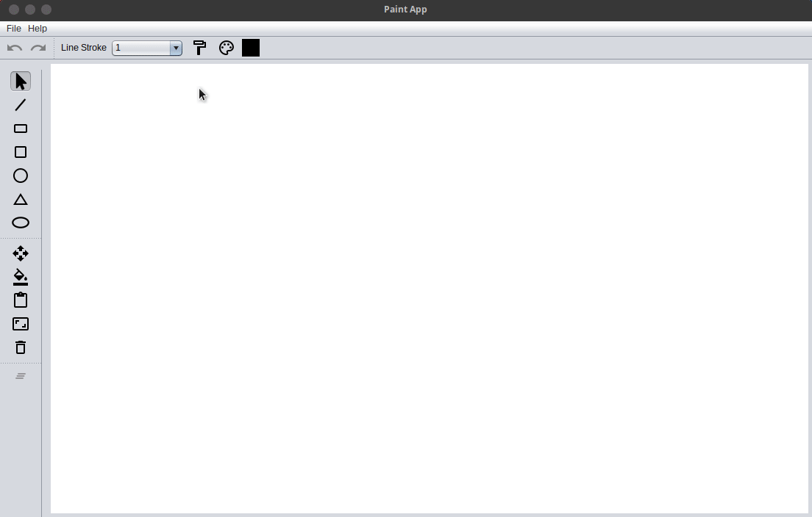
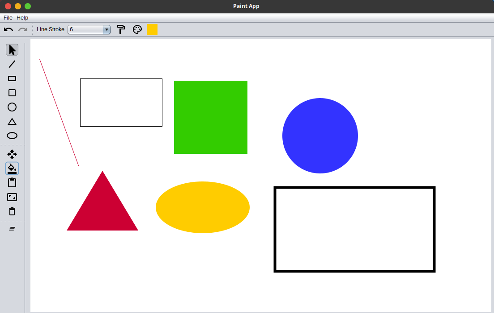
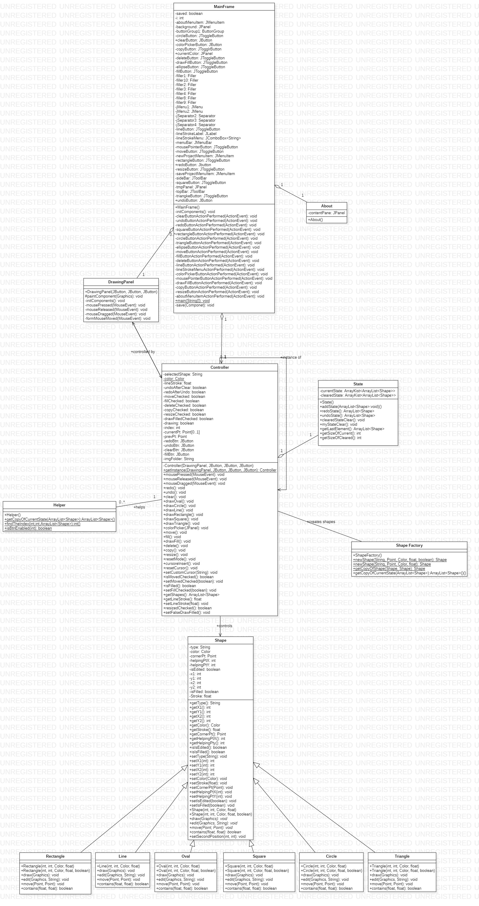

# Paint Program

A paint program is a software graphics program that allows the user to draw, color, or paint bitmapped images on a computer.

- [Paint Program](#paint-program)
  - [Authors](#authors)
  - [Badges](#badges)
  - [Demo](#demo)
  - [Screenshots](#screenshots)
  - [UML](#uml)
    - [Class Diagram](#class-diagram)
    - [Use Case Diagram](#use-case-diagram)
  - [Features](#features)
  - [Design Patterns](#design-patterns)
  - [Documentation](#documentation)
    - [Folder Structure Outline](#folder-structure-outline)
    - [Packages](#packages)
    - [Models](#models)
      - [Shape.java](#shapejava)
      - [Rectangle.java](#rectanglejava)
      - [Square.java](#squarejava)
      - [Ellispe.java](#ellispejava)
      - [Circle.java](#circlejava)
      - [Line.java](#linejava)
      - [Triangle.java](#trianglejava)
      - [ShapeFactory.java](#shapefactoryjava)
    - [Controllers](#controllers)
      - [Controller.java](#controllerjava)
      - [State](#state)
      - [Helper](#helper)
  - [Run Locally](#run-locally)

## Authors

- Amr Abdelsamee Yousef (7126)
- Mohammed Saeed Abdelhafz (7034)
- Hussein Mourad Kassem (6729)
- Ahmed Saeed Nouh (7086)

## Badges


## Demo 



## Screenshots




## UML

### Class Diagram



### Use Case Diagram


## Features

Single Responsibility Principle Each class should be responsible for a single part or functionality of the system.
Open-Closed Principle Software components should be open for extension, but not for modification.
Liskov Substitution Principle Objects of a superclass should be replaceable with objects of its subclasses without breaking the system.
Interface Segregation Principle No client should be forced to depend on methods that it does not use.
Dependency Inversion Principle High-level modules should not depend on low-level modules, both should depend on abstractions.

- Draw Shapes: Line, Rectangle, Square, Ellipse, Circle, and Triangle
- Change stroke size
- Change fill Color
- Move different Shapes
- Delete different Shapes
- Clear all Shapes
- Save Project as png
- Undo / Redo
- Copy / Paste

## Design Patterns

We followed mvc, singleton, and Factory design patterns

- The controller is a singleton class.
- The Shapes are drawn using Factory class that follows factory design pattern.
- The folder structure is following mvc design pattern.

There are more design patterns that we could have used in our program. Such as:

- Command or Memento design pattern to handle state
- Builder design pattern to draw shapes

## Documentation

### Folder Structure Outline

```
src
├── Assets
│   └── Images
├── Controllers
│   ├── Controller.java
│   ├── Helper.java
│   └── State.java
├── Models
│   ├── Circle.java
│   ├── Line.java
│   ├── Oval.java
│   ├── Rectangle.java
│   ├── ShapeFactory.java
│   ├── Shape.java
│   ├── Square.java
│   └── Triangle.java
└── Views
    ├── About.java
    ├── DrawingPanel.java
    └── MainFrame.java
```

### Packages

There a three main packages: Models, Views, and Controllers

### Models

Models package contain all the logic required for drawing different shapes.

#### Shape.java

Each Shape inherit from their an abstact parent class called shape which contain common needed data and logic between classes. The most important ones are draw, move, resize, and delete

#### Rectangle.java

It has all the logic required to handle operations on rectangle it is a child to shape abstract class

#### Square.java

The square class is a rectangle with width and height are equal so square class is the same a rectangle class but with little differences

#### Ellispe.java

It handles the drawing of the ellipse. The class follows the same structures as any other class in the package

#### Circle.java

A circle is a special case of ellipse so the two classes are very similar. but width and height of circle is the same

#### Line.java

It draws a line by joining two points together.

#### Triangle.java

It stores the three edges of the triangle so it can draw it.

#### ShapeFactory.java

It is the factory for the shapes it constructs different shapes, makes a copy of the shape, and copies the current state of shapes.

### Controllers

This package takes care of all different controllers and helper function that is used alongside the views

#### Controller.java

This is the main controller of the program it handles:

- Current state of the program
- The different mouse events
- Changing of the cursor
- Undo and Redo
- Copy
- Inserting Shapes
- Moving Shapes
- Filling Shapes
- Removing Shapes
- Clearing all Shapes
- Changing the cursor
- Disabling and enabling buttons

#### State

This class models the current state of the program it is used alongside controller to handle different states. It is responsible for undo, redo, and clearing of the state.

#### Helper

This class carries different helper function:

- Copy current state: copies current state of the program
- isBtnEnabled: checks if a undo can be enabled
- findTheIndex: finds the index from an ArrayList of Shapes

## Run Locally

Navigate to the project folder

```bash
   cd Paint-App/
   java -jar Paint.jar
```
